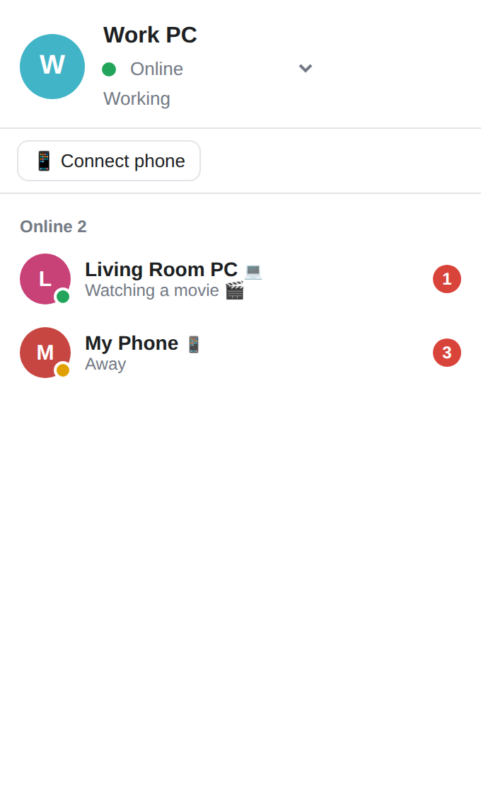
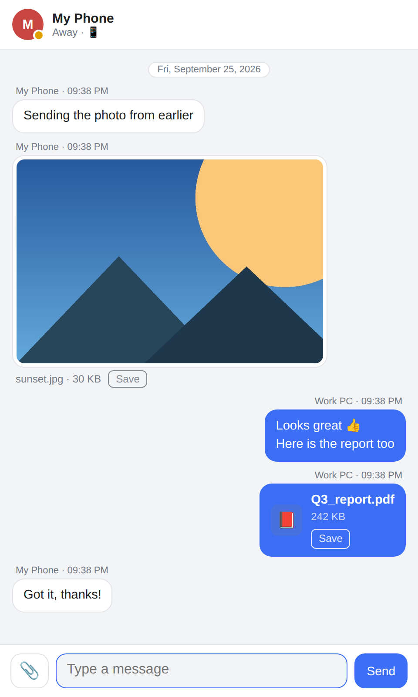
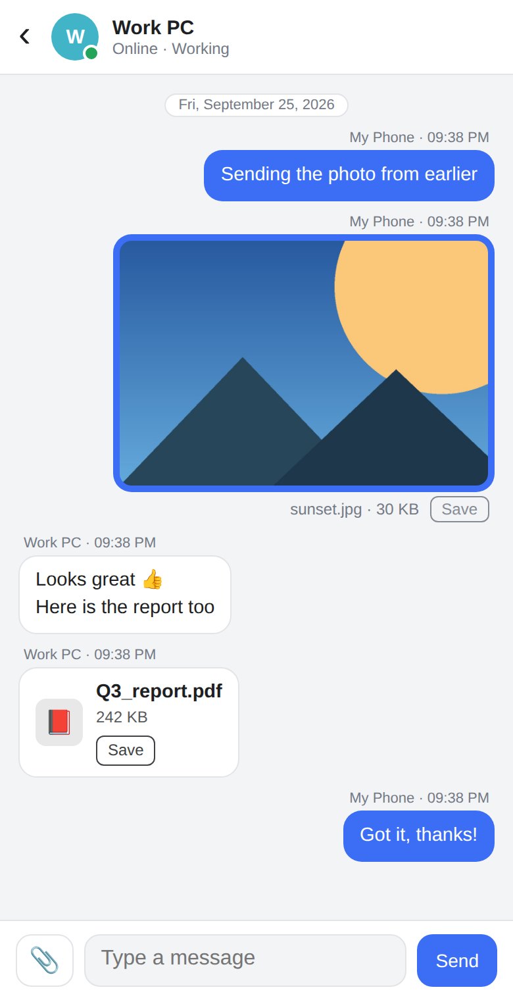

<p align="center"></p>
<h1 align="center">LAN Chat</h1>
<p align="center">
  Serverless LAN messenger — chat and share files between PCs and phones on the same Wi-Fi.<br>
  No server, no sign-up, no internet required.
</p>
<p align="center">
  <a href="https://github.com/HaminSong/lanchat/releases/latest/download/LANChat-Setup.exe"><b>⬇ Download for Windows</b></a> ·
  <a href="https://haminsong.github.io/lanchat/">Website</a> ·
  <a href="https://github.com/HaminSong/lanchat/releases">Releases</a>
</p>

<p align="center">
  
  
  
</p>

## Features

- **Automatic discovery** — PCs and phones on the same network appear in your list (UDP broadcast)
- **One window per conversation** — new messages pop up with a notification sound
- **Files & photos** — drag and drop, paste or attach; received files are saved to `Documents\LAN Chat`
- **Phones included** — scan the QR code on any PC to join from the browser, no app to install
- **Offline delivery** — messages to a PC that's off are queued and delivered when it comes back
- **Stays on your network** — peer-to-peer inside your LAN, nothing stored on outside servers
- **English / Korean** — English by default, switch to Korean from the language menu

## Install

1. Download and run [LANChat-Setup.exe](https://github.com/HaminSong/lanchat/releases/latest/download/LANChat-Setup.exe)
2. Install it on other PCs connected to the same router
3. (Optional) Click **📱 Connect phone** and scan the QR code with your phone

> If Windows shows “Windows protected your PC”, click **More info → Run anyway** (the installer isn't code-signed).
> If other devices don't appear, set your Windows network profile to **Private**.

Requirements: Windows 10 / 11 (64-bit), WebView2 Runtime (included with Windows 11)

## How it works

```
PC (LANChat.exe)                              PC (LANChat.exe)
 ├─ HTTP server :8000  ◀─── messages / files ───▶  HTTP server :8000
 ├─ UDP :50505 beacon  ◀─── discovery (broadcast) ─▶ UDP :50505
 └─ WebView2 window (UI)                       └─ WebView2 window
        ▲
        └── Phone browser (same UI, live updates over SSE)
```

- No central server: each PC hosts its own user plus any phones that joined through it
- Messages go directly to the recipient's PC; failed deliveries are queued and retried
- One HTML UI shared by the desktop window (pywebview) and phone browsers
- Built on the Python standard library (`http.server`, `socket`); only `pywebview` and `segno` (QR) are external

## Build from source

On Windows with Python 3.10+:

```bat
build.bat
```

This installs the packages, builds the app with PyInstaller and creates the installer with Inno Setup (`installer\LANChat-Setup.exe`).

Run directly from source:

```bat
py -m pip install pywebview segno
py lanchat.py            :: desktop window
py lanchat.py --browser  :: open in the default browser
```

## License

[MIT](LICENSE)
